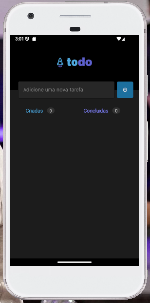
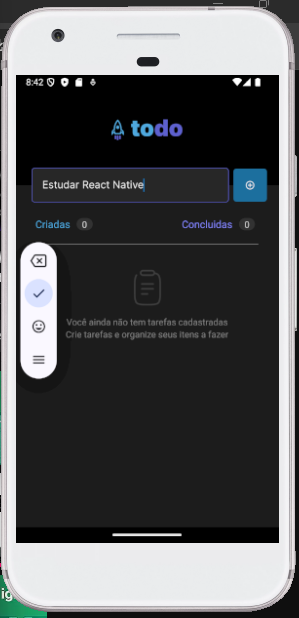
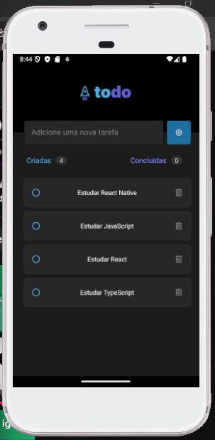
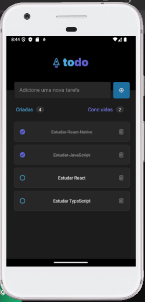
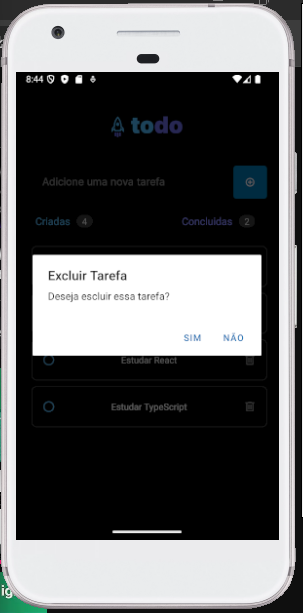
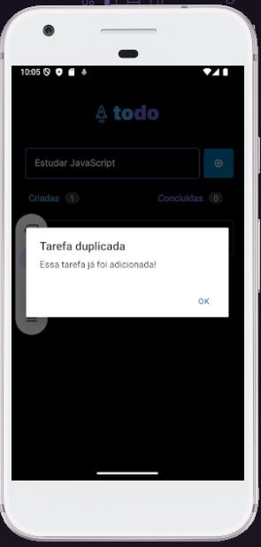

<h1 align="center"> TodoList </h1>

Projeto está finalizado, é um projeto indicado pelo o pessoal do curso da Rochetseat, para praticarmos os nossos conhecimentos adquirido durante o curso. 

  <a href="#-tecnologias">Tecnologias</a>&nbsp;&nbsp;&nbsp;|&nbsp;&nbsp;&nbsp;
  <a href="#-projeto">Projeto</a>&nbsp;&nbsp;&nbsp;|&nbsp;&nbsp;&nbsp;
  <a href="#-estudo">Estudo</a>&nbsp;&nbsp;|&nbsp;&nbsp;&nbsp;

 

  
  
  
  
  
  

## 🚀 Tecnologias

Esse projeto foi desenvolvido com as seguintes tecnologias:

- React Native
- TypeScript
- Git e Github

## 💻 Projeto

O TodoList é uma aplicação mobile de criação e controle de tarefas.

## 📓 Estudo

O professor falou que não podemos nos preocupar em decorar os códigos e se for o caso de ter dúvidas procurasse nos códigos anteriores.

Então esse projeto não foi feito 100% da minha cabeça, tive ajuda dos códigos feito pela as aulas anteriores.
