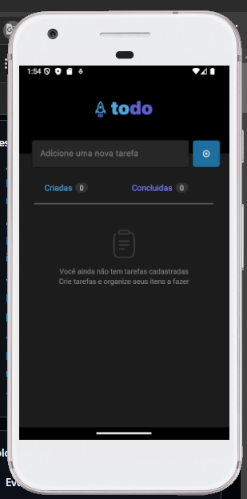

<h1 align="center"> TodoList </h1>

Esse projeto ainda está em andamento, é um projeto indicado pelo o pessoal do curso da Rochetseat, para praticarmos os nossos conhecimentos adquirido durante o curso. 

  <a href="#-tecnologias">Tecnologias</a>&nbsp;&nbsp;&nbsp;|&nbsp;&nbsp;&nbsp;
  <a href="#-projeto">Projeto</a>&nbsp;&nbsp;&nbsp;|&nbsp;&nbsp;&nbsp;

 

  

## 🚀 Tecnologias

Esse projeto está sendo desenvolvido com as seguintes tecnologias:

- React Native
- TypeScript
- Git e Github

## 💻 Projeto

O TodoList é uma aplicação mobile de criação e controle de tarefas.
